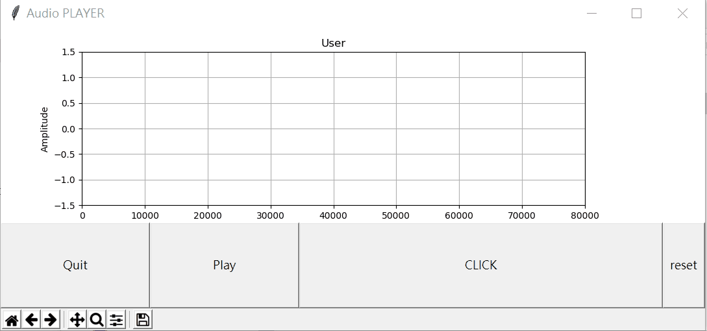

# Audio-player-and-tagger
Audio player for real-time tagging and playing implemented in python Tkinter

# Description
This unser interface load the files in ```./data``` and do the real-time playing and plotting the current position modified from [here](https://gist.github.com/seyyah/3916450).   
It also can be used as **labeling** and indicating the time stamps.   
Currently the buttons consists of **Quit**, **Play**, **Click** and **reset**, which are also bound by keyboard **Q**, **P**, **Space bar** and **R**.  
It is quite easy to plug in more customized functions and buttons as you like.

# Demo

